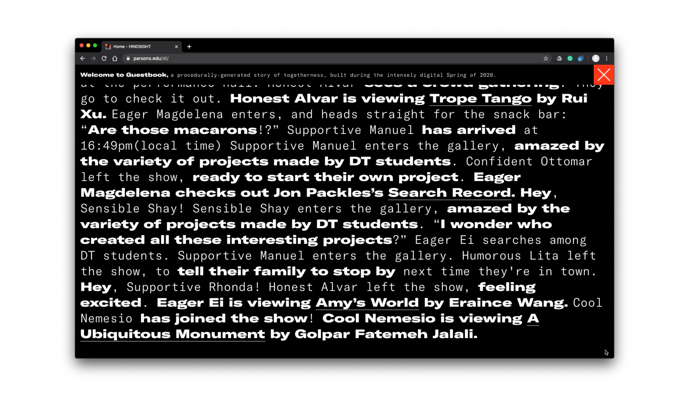

<iframe frameborder="0" allowfullscreen="" scrolling="no" allow="autoplay;fullscreen" src="https://onelineplayer.com/player.html?autoplay=true&autopause=false&muted=true&loop=true&url=https%3A%2F%2Fwww.dropbox.com%2Fs%2Fblp9kpr2yldsyhw%2Fscreengrab_guestbook01.mov%3Fraw%3D1&poster=&time=false&progressBar=false&overlay=false&muteButton=false&fullscreenButton=false&style=light&quality=auto&playButton=false" style="position: absolute; height: 100%; width: 100%; left: 0px; top: 0px;"></iframe>

This is the spring of 2020. Gallery spaces across the world are closed, classes are online, and Parsons Design and Technology program has decided to transform its thesis festival into a virtual show. It is unfortunate that a physical celebration cannot be actualized during the pandemic, nonetheless, we wanted to try our best to maintain the level of engagement and livelihood through an online virtual show. Thus, we created “Hindsight Guestbook”, a procedurally-generated story of distant togetherness as well as a creative solution to virtual participation during this intensely digital time.

“Hindsight Guestbook” appears by default as a scroll-bar floating at the bottom of the Hindsight thesis show site. Once the visitor clicks on the book icon, the Guestbook expands, revealing its full-length, infinite-scroll of current and past generated story. 

Every online visitors’ live footprints are translated into different types of semi-fictional narratives at real time as if they are visiting the thesis show physically. For example, the moment when one visitor opens the site for the first time, this visitor will be assigned a random name and a random welcome message from a pool of placeholder messages will be added to the overall story. An action such as clicking on a student’s project will be translated into something like “Inspired Josef checks out Jodi Comer’s The better days under the surveillance.” The project will also be hyperlinked with the actual project page, so visitors can click on others’ stories to view students’ projects.

  
### Technical breakdown

The latest generated content will get appended at the bottom.

Hindsight guestbook is made with socket.io. There is the server that process activities, a Heroku database that stores all the generate lines, and a client–Hindsight thesis site that pulls socket request from the server. The server-side handles all the incoming activities and passes activities into different categories of algorithms that generate story-like sentences. It returns strings that the client-side can just append to any version of “Guestbook”. In project pages where project hyperlinks are linked to, a specially named class will be embedded in every page, so that data can be passed to the Guestbook server as well. 

Visit the guestbook at [Hindsight Guestbook](https://parsons.edu/dt).

