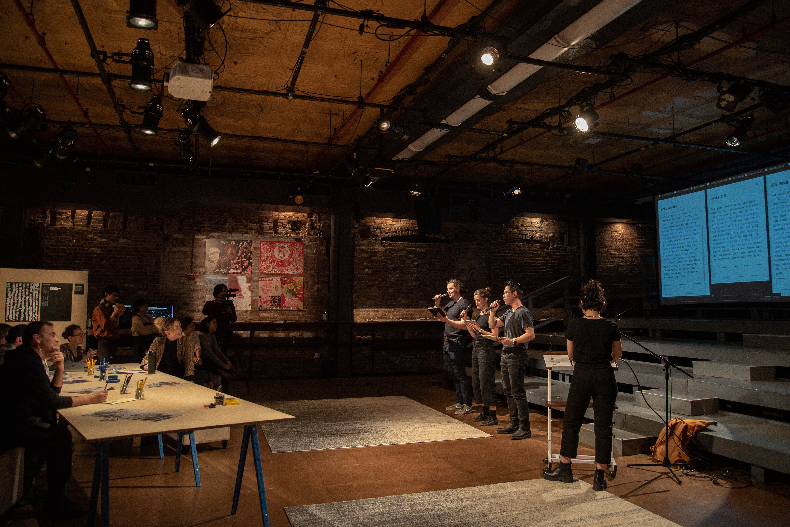
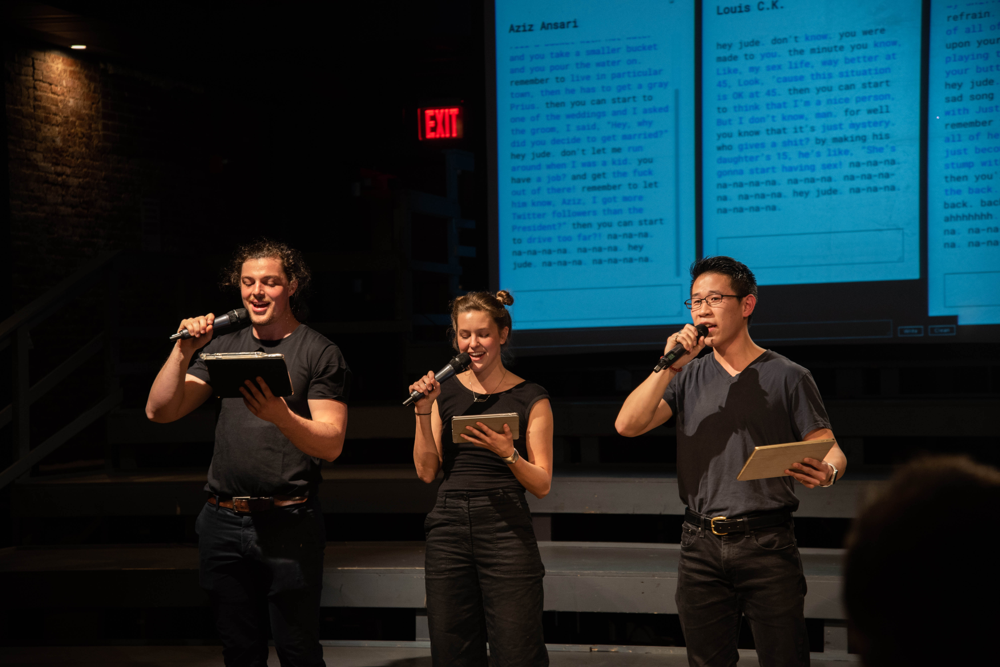
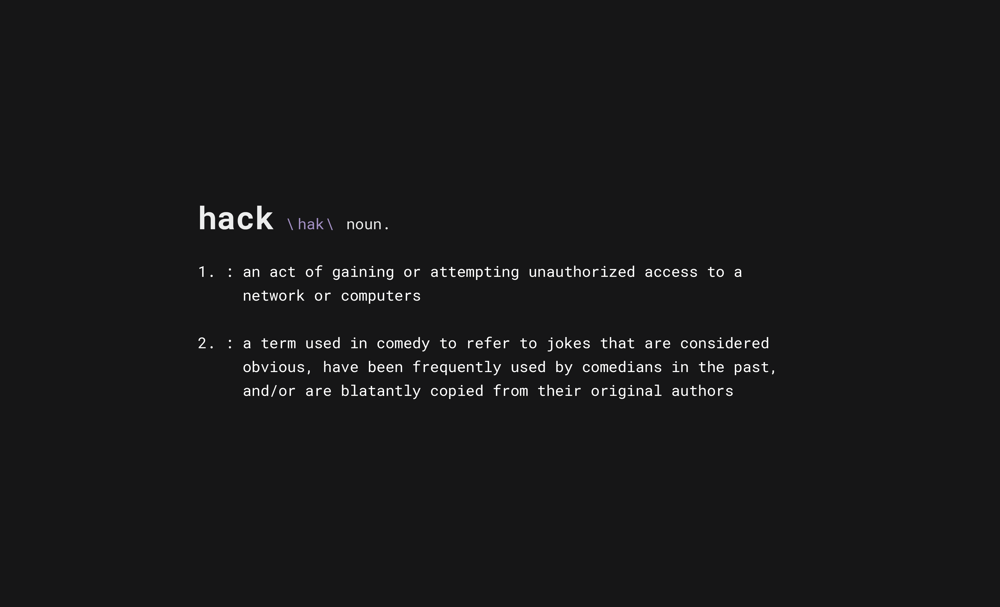
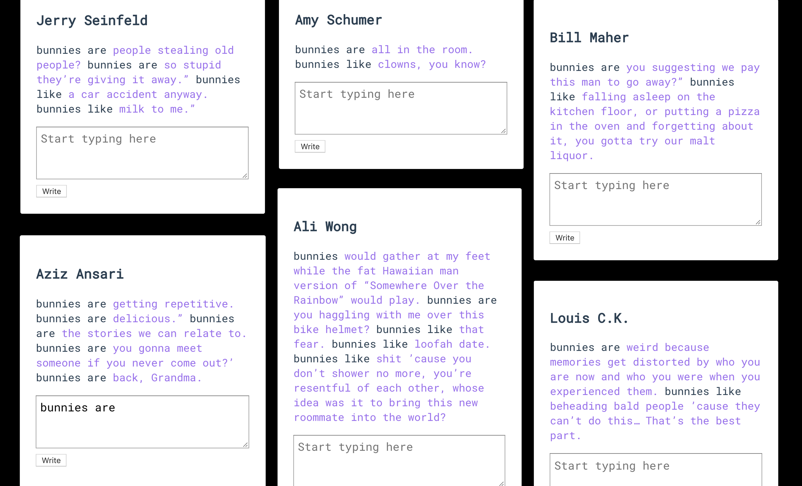

Video Credit: Lu Gao

The performance was part of the three-day [Re:Fest festival hosted by Culture Hub NYC](https://www.culturehub.org/refest-2020). It was live streamed on March 12th, 2020 at the La Mama Experimental Theater.

Photo Credit: Lu Gao

Photo Credit: Lu Gao

 

<iframe frameborder="0" allowfullscreen="" scrolling="no" allow="autoplay;fullscreen" src="https://onelineplayer.com/player.html?autoplay=false&autopause=false&muted=false&loop=false&url=https%3A%2F%2Fvimeo.com%2F401715029&poster=&time=false&progressBar=false&overlay=true&muteButton=false&fullscreenButton=false&style=light&quality=auto&playButton=false" style="position: absolute; height: 100%; width: 100%; left: 0px; top: 0px;"></iframe>

Video Credit: Culture Hub NYC

