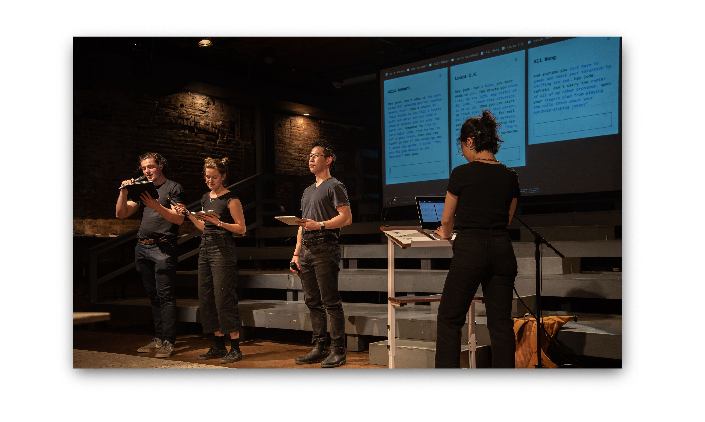

The performance was part of the three-day [Re:Fest festival hosted by Culture Hub NYC](https://www.culturehub.org/refest-2020). It was live streamed on March 12th, 2020 at the La Mama Experimental Theater.

