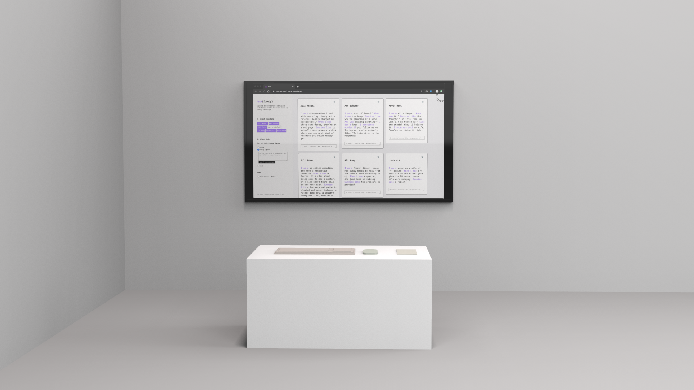
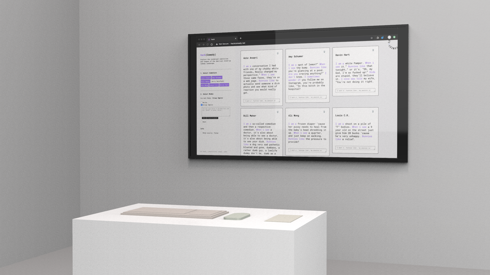

<iframe frameborder="0" allowfullscreen="" scrolling="no" allow="autoplay;fullscreen" src="https://onelineplayer.com/player.html?autoplay=true&autopause=false&muted=true&loop=true&url=https%3A%2F%2Fwww.dropbox.com%2Fs%2Fepndktm8nsns3zf%2Fhack_interface00.mov%3Fraw%3D1&poster=&time=false&progressBar=false&overlay=false&muteButton=false&fullscreenButton=false&style=light&quality=auto&playButton=false" style="position: absolute; height: 100%; width: 100%; left: 0px; top: 0px;"></iframe>

Hack(Comedy) is a computational comedy web application that allows visitors to write with virtual comedians who generate materials from borrowed comic sources.

It aims to interrogate our perception of humor through a procedurally live generation that copies and reflects condensed themes and identities in the American comedy landscape. With text input such as words and phrases, virtual comedian modules will complete writing sentences using word references from the scraped transcript compilations.

Visitors can interact with virtual comedians in various ways. You can write with one comedian at a time, compare different comedians' output to the same input simultaneously, or assign a fixed length of words you want all selected comedians to rant on their own for. 

My native language isn't English and I struggled to become culturally competent. I wanted to use this unexpected way of programming to reach the American humor pedestal. The process, however, reinforces the failure of the my ideal pursuit of cultural competency and the comic absurdity of the pursuit itself.

<b>Computational Comedy</b>, which stands for using procedural methods to produce comic text, is my year-long MFA thesis project investigation at Parsons Design and Technology program.

