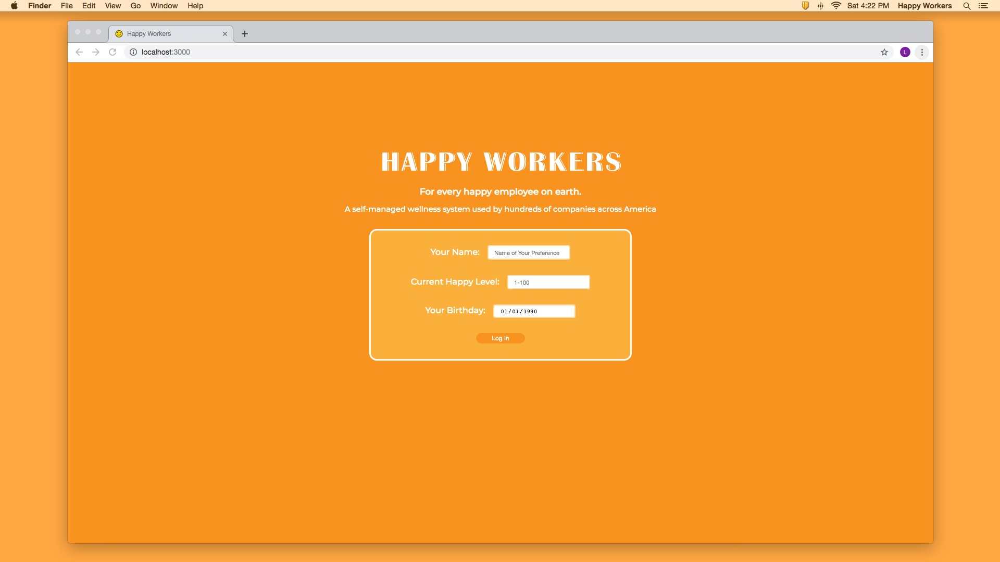
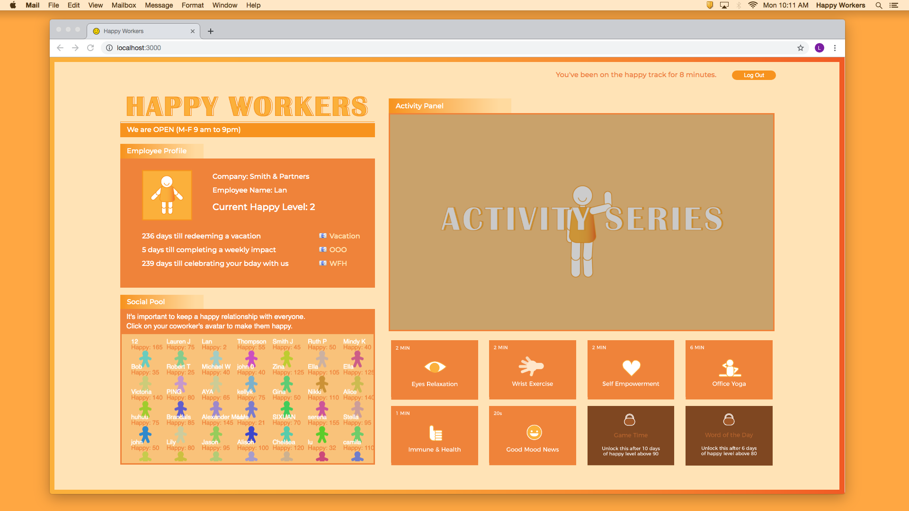
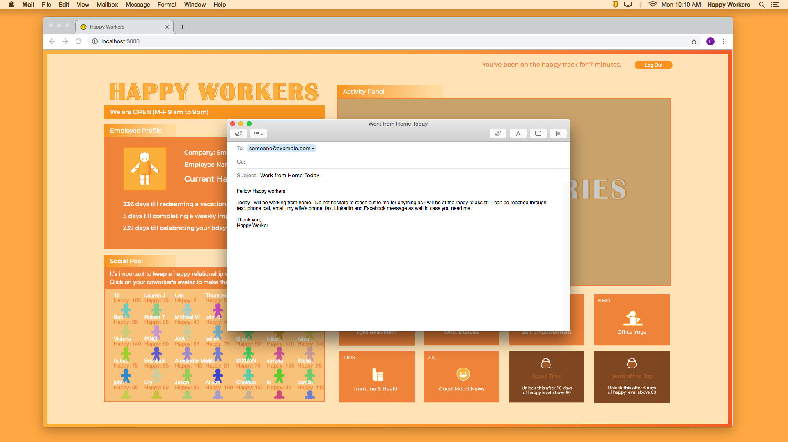
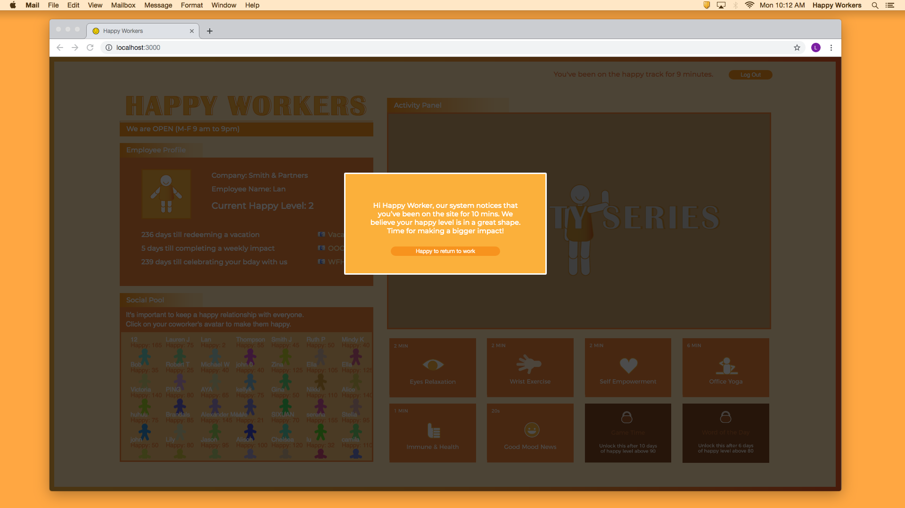
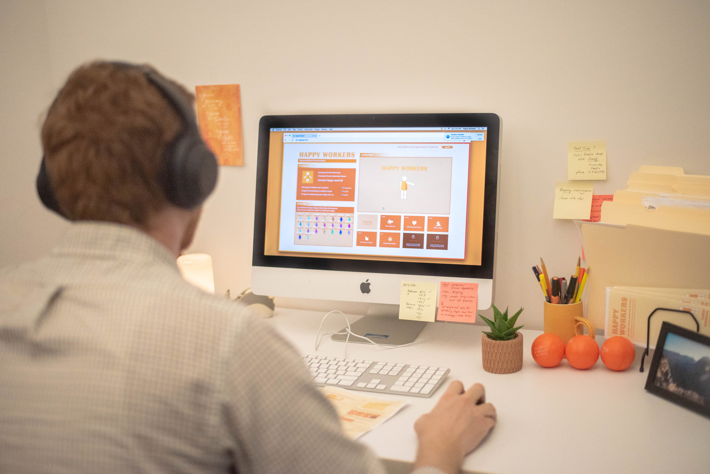
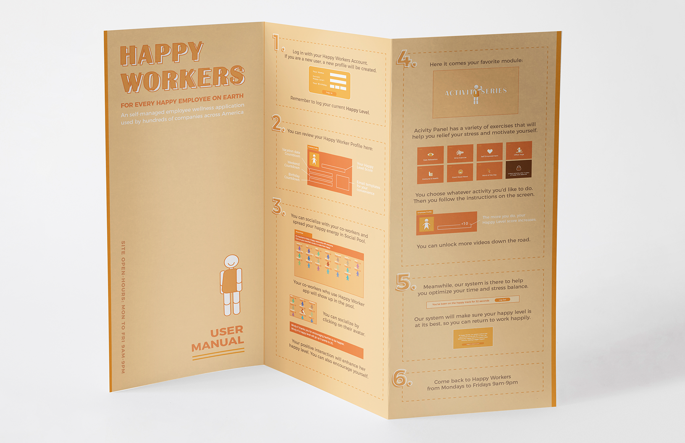

<!--  -->

<iframe frameborder="0" allowfullscreen="" scrolling="no" allow="autoplay;fullscreen" src="https://onelineplayer.com/player.html?autoplay=true&autopause=false&muted=true&loop=true&url=https%3A%2F%2Fwww.dropbox.com%2Fs%2Fwixzjj228c6cbke%2Fhappyworkers.mov%3Fraw%3D1&poster=&time=false&progressBar=false&overlay=false&muteButton=false&fullscreenButton=false&style=light&quality=auto&playButton=false" style="position: absolute; height: 100%; width: 100%; left: 0px; top: 0px;"></iframe>

This project aims to portray the ambiguity in workers’ autonomy  over stress-management under organizational control and the sarcastic belief that an individual is held responsible for overcoming stress caused by the corporate workplace culture. It also interrogates our intertwined relationship with productivity or wellness applications companies currently are imposing, entrusting digital monitoring and measurements to improve our physical well being in the workplace.

 

### What can you do on Happy Workers?
The website opens from Mondays to Fridays from 9 am to 9 pm. It consists of modules that allow employees to cope with stress and feel motivated within their limited physical space and resources. 

For example, the activity module prompts employees with small mindful or physical exercise videos that are promoting the performance of leisure within the cubicle space. The activity videos will heavily emphasize on the digitally measured outcome–individual’s happiness level while making sure that the employees do not seize outlets beyond their desk space. 

The social module allows them to give and receive encouragements from their co-workers and bosses. Anyone who gets a cheerful click will display a thankful message with five points added to their happiness level. 

The profile module showcases the participant’s necessary information, as well as vacation or break days countdown that is coated with company-centered connotation. 

At the same time, the web app will be continually counting the time the user has spent on the site. Once the set time limit reaches, the user will receive a friendly warning to log out the system and to return to their job duties, happily.

 

### Major-Major Exhibition
This project was part of the Parsons MFA Design and Technology Major Major End-of-Year Show. Audiences were invited to the themed workplace cubicle to experience the wellness web application as an “employee.” Every participant was given out an manual that also serves as a project label.
 

"Activity Series" video example: <b> Plant workout at your desk</b>

<iframe frameborder="0" allowfullscreen="" scrolling="no" allow="autoplay;fullscreen" src="https://onelineplayer.com/player.html?autoplay=false&autopause=false&muted=false&loop=false&url=https%3A%2F%2Fwww.dropbox.com%2Fs%2Fvnug6sblmwtgb39%2Fhappyworkers_plant.mp4%3Fraw%3D1&poster=&time=true&progressBar=true&overlay=true&muteButton=true&fullscreenButton=false&style=light&quality=auto&playButton=true" style="position: absolute; height: 100%; width: 100%; left: 0px; top: 0px;"></iframe>

 Voiceover: Victoria Pineda, Soundtrack remix: Eraince Wang

