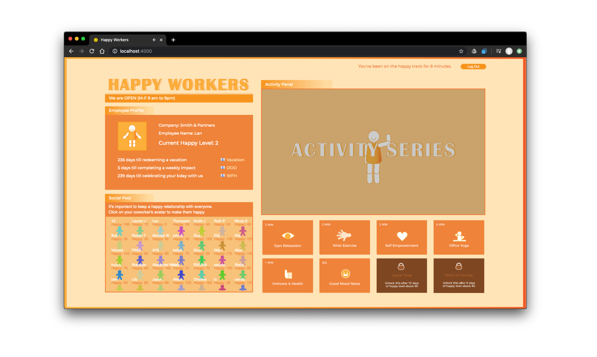

This project aims to portray the ambiguity in workers’ autonomy  over stress-management under organizational control and the sarcastic belief that an individual is held responsible for overcoming stress caused by the corporate workplace culture. 

It also interrogates our intertwined relationship with productivity or wellness applications companies currently are imposing, entrusting digital monitoring and measurements to improve our physical well being in the workplace.