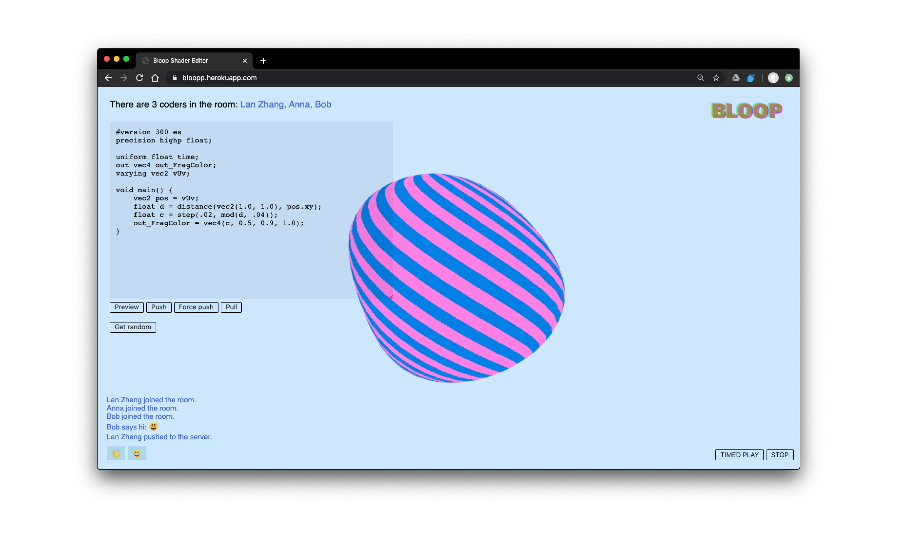
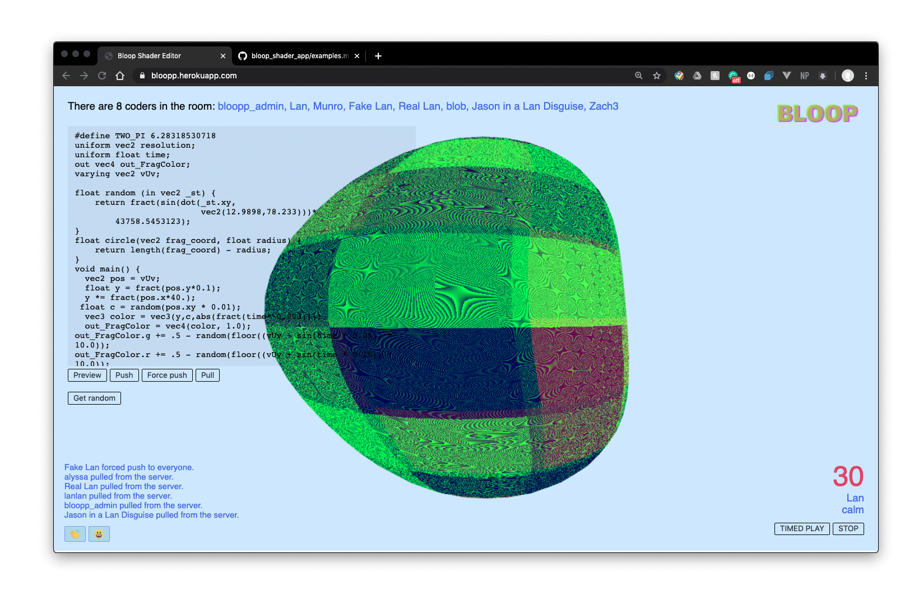
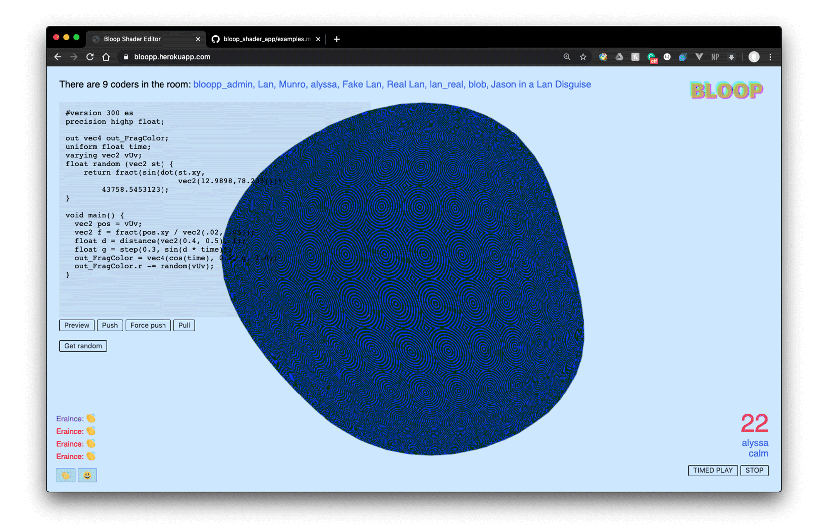
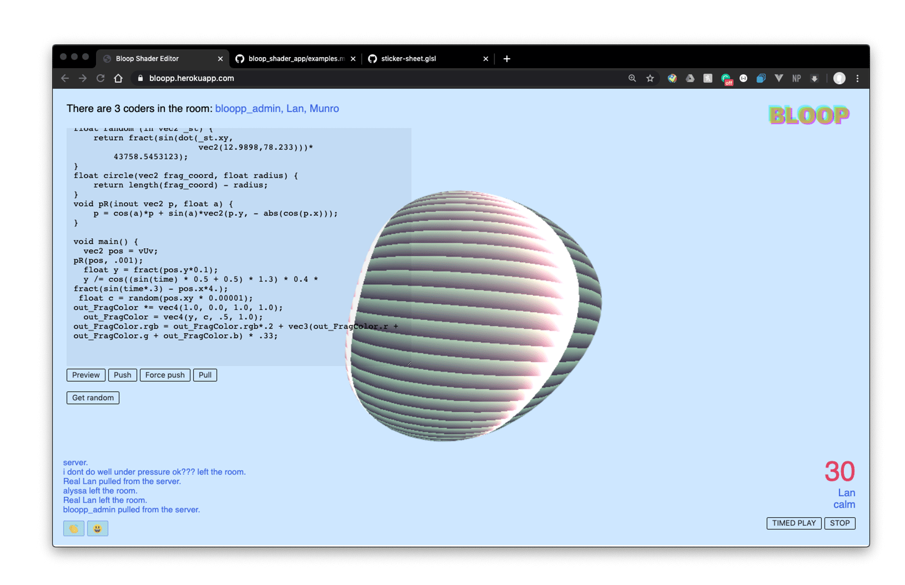
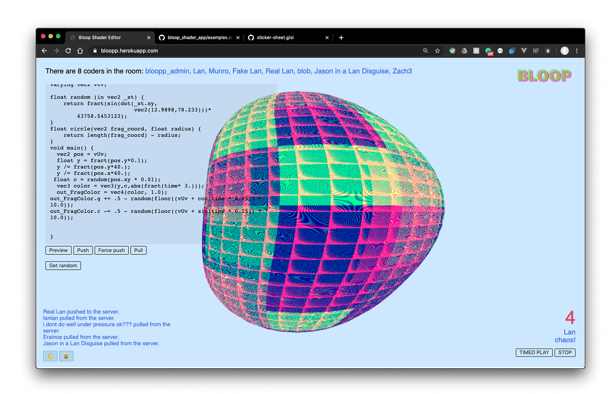

<!--  -->

<iframe frameborder="0" allowfullscreen="" scrolling="no" allow="autoplay;fullscreen" src="https://onelineplayer.com/player.html?autoplay=true&autopause=false&muted=true&loop=true&url=https%3A%2F%2Fwww.dropbox.com%2Fs%2Fca29onyj1d4kmrj%2FBloop_interface00.mov%3Fraw%3D1&poster=&time=false&progressBar=false&overlay=false&muteButton=false&fullscreenButton=false&style=light&quality=auto&playButton=false" style="position: absolute; height: 100%; width: 100%; left: 0px; top: 0px;"></iframe>

<b>Bloop</b> is multi-user online coding environment for collaboratively making GLSL shaders on a blob geometry. 

How do we user it? It's pretty simple! Coders enter the Bloop room, edit the shader code, and share their shader sketch with everyone in the room through a blob geometry!

There are a couple of benefits coders can interact with each other’s sketch. <b>“Preview”</b> allows you locally compile and preview your current code; <b>“Push” </b>allows you to upload your current local sketch to the server(that gets overwritten by whoever pushes the last); <b>“Force push” </b>allows you to instantly update others’ blobs and code with your current local version(Risky and bold); <b>“Pull”</b> allows you to update your current sketch with the latest update from the server. Last but not the least, <b>“Random Sketch”</b> will get you a random sketch stored in the Bloop library, in case you need some inspiration. 

 
 

### Social Shading & Social Distancing: A Shader workshop 
This web editor was made in response to our shader community study class at Parsons D&T program being moved online during Covid19 social distancing protocol. We wanted to create a platform that makes remote learning and collaborating fun.
You can find the workshop materials [here](https://www.notion.so/Social-shading-with-social-distancing-70b8a9e5744e489cb082f7f6d1c09669).

For the workshop, we added a <b>game mechanism</b> where the system randomly picks up a coder in the room to start coding with a 30-seconds countdown. Then when the next person is up, they will need to pull the latest sketch and make edits. The goal is to collectively create an interesting shader blob with everyone in the room.

Some beautiful work made collectively during our first session of “Social Shading during Social Distancing”:

