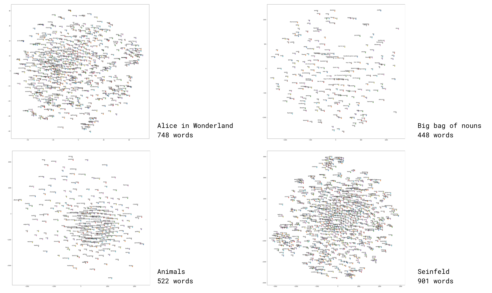

<iframe frameborder="0" allowfullscreen="" scrolling="no" allow="autoplay;fullscreen" src="https://onelineplayer.com/player.html?autoplay=true&autopause=false&muted=true&loop=true&url=https%3A%2F%2Fwww.dropbox.com%2Fs%2Flyvl1a55f06yk3m%2Ftoast2word_interface00.mov%3Fraw%3D1&poster=&time=false&progressBar=false&overlay=false&muteButton=false&fullscreenButton=false&style=light&quality=auto&playButton=false" style="position: absolute; height: 100%; width: 100%; left: 0px; top: 0px;"></iframe>

“Toast” is a word guessing game using [Word2Vec](https://spacy.io/usage/vectors-similarity)(words to vector data). We transformed various collections of themed nouns, based on their semantic meanings, into points plotted in a two-dimensional space. Similar words or words of the same category appear closer together on the map. Words that are semantically different are further apart. For example, "bread" and "toast" appear close together while "motorcycle" and "toast" can be further apart.

The game rule is simple. With any word collection of player’s choice, the computer randomly selects a mystery word. The goal is for the player to guess the target word with the least guesses by asking the computer a series of questions like “Is this target word closer to __ or __?” The computer will calculate the semantic distance between the hidden target word and players’ guesses. It will always respond with the word that’s closer to the target until the target word is found.

 

 
So far, we have four collections of words. For some, we scraped from the internet then extracted the special nouns. For some, we found existing noun collections online. We fed the extracted collections into spaCY’s word2vec model to get the multi-dimensional vector data of every single word. Then, we use tSNE to deduct the multi-dimensional vector to two-dimensions so every word will have an x and y coordinate within a two-dimensional vector space.
