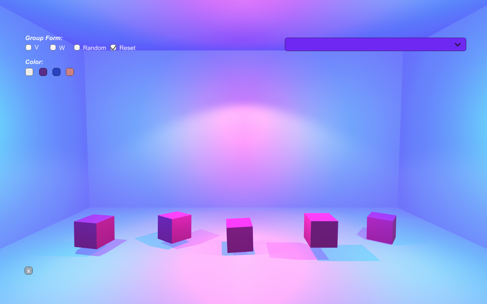

<iframe frameborder="0" allowfullscreen="" scrolling="no" allow="autoplay;fullscreen" src="https://onelineplayer.com/player.html?autoplay=true&autopause=false&muted=true&loop=true&url=https%3A%2F%2Fwww.dropbox.com%2Fs%2Fcbpy2xddl3gacva%2Fcubi_interface00.mov%3Fraw%3D1&poster=&time=false&progressBar=false&overlay=false&muteButton=false&fullscreenButton=false&style=light&quality=auto&playButton=false" style="position: absolute; height: 100%; width: 100%; left: 0px; top: 0px;"></iframe>

 

### Cubi I

 

Cubi is a three-dimensional music visualizer made with Unity. The visualizer consists of five cube members. Altogether, they become a band that dances along to any preloaded music. Each cube rotates, jumps with force, and vibrates, in response to a different volume level’s spectrum data. You can change the formation of the band as if they are a human-band on stage. You can also change the sound track at any point. 

<iframe frameborder="0" allowfullscreen="" scrolling="no" allow="autoplay;fullscreen" src="https://onelineplayer.com/player.html?autoplay=false&autopause=false&muted=false&loop=true&url=https%3A%2F%2Fwww.dropbox.com%2Fs%2Fef3br5m3m3dcadm%2Fcubi_interface01.mov%3Fraw%3D1&poster=&time=false&progressBar=true&overlay=true&muteButton=true&fullscreenButton=false&style=light&quality=auto&playButton=true" style="position: absolute; height: 100%; width: 100%; left: 0px; top: 0px;"></iframe>

A video demo of Cubi I</b>

 

### Cubi II

Cubi II is the extended life of Cubi. Cubi tries to visualize music. Cubi II tries to visualize as well as sonifies words!

Cubes within Cubi II now have a more in-depth visualized relationship with its source. Hundreds of cubes move within a three-dimensional space in response to semantic meaning of words, specifically words within a poem called “Wild Geese” by Mary Oliver. All words from the poem are mapped and reduced to a two-dimensional space using Word2Vec. And these words are individually mapped to Cubi cubes with a correspondingly assigned sound-frequency data(0-48000 hertz are mapped to an x,y coordinate space with y=x^2). 

<iframe frameborder="0" allowfullscreen="" scrolling="no" allow="autoplay;fullscreen" src="https://onelineplayer.com/player.html?autoplay=false&autopause=false&muted=false&loop=true&url=https%3A%2F%2Fwww.dropbox.com%2Fs%2Flk2thv1308dnfx6%2Fcubi_poem.mov%3Fraw%3D1&poster=&time=false&progressBar=true&overlay=true&muteButton=true&fullscreenButton=false&style=light&quality=auto&playButton=true" style="position: absolute; height: 100%; width: 100%; left: 0px; top: 0px;"></iframe>

A video demo of Cubi II</b>

Cubes are connected by a thread that starts drawing when the first word of the poem is computationally read. Once the poem starts to "read" every word in the poem sequentially, cubes will lit up by its order, hop a little and produce a unique sound pitch. The variant heights you see among the cubes are determined by each word's length(ex. "Mary" will be lower than "Meanwhile"). And the camera changes its center focus based on its Dot product with each word's coordinate.