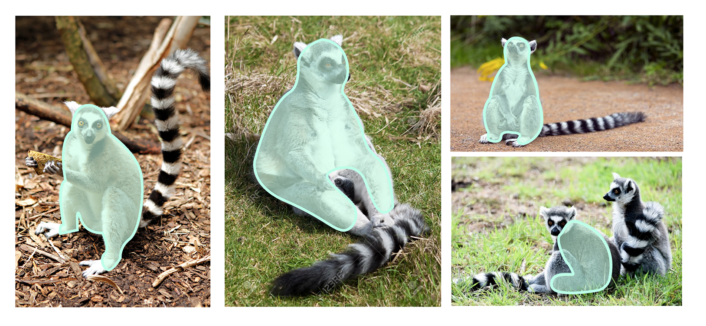

<iframe frameborder="0" allowfullscreen="" scrolling="no" allow="autoplay;fullscreen" src="https://onelineplayer.com/player.html?autoplay=true&autopause=false&muted=true&loop=true&url=https%3A%2F%2Fwww.dropbox.com%2Fs%2Fmwckg16ddtrhksx%2FStopmotion.mp4%3Fraw%3D1&poster=&time=false&progressBar=false&overlay=false&muteButton=false&fullscreenButton=false&style=light&quality=auto&playButton=false" style="position: absolute; height: 100%; width: 100%; left: 0px; top: 0px;"></iframe>

You might be intrigued, wondering why I made a grooming machine for Ring-tailed lemurs. This was a semester-long investigation I did during my “Interaction Design in the Wild” class co-taught by Parsons School of Design and San Diego Zoo.

 

 

<iframe frameborder="0" allowfullscreen="" scrolling="no" allow="autoplay;fullscreen" src="https://onelineplayer.com/player.html?autoplay=false&autopause=false&muted=false&loop=false&url=https%3A%2F%2Fwww.dropbox.com%2Fs%2Fk2nh2i7lxj8fko0%2Frtl_groomer.mp4%3Fraw%3D1&poster=&time=true&progressBar=true&overlay=true&muteButton=true&fullscreenButton=false&style=light&quality=auto&playButton=true" style="position: absolute; height: 100%; width: 100%; left: 0px; top: 0px;"></iframe>

A project overview <b>demo video</b>

The goal was to research an animal and to create an intervention that would improve their welfare. Throughout my project process, I had back-and-forth conversations with lemur experts at the Duke Lemur Center, the San Diego Zoo, the Bronx Zoo to make sure my project was fitted, meaningful and not anthropocentric. 

 

Allo-grooming device component breakdown</b>

I created a series of objects that were meant for bettering Ring-tailed lemurs lives in a zoo setting. There was the modular foraging box that mimics their probing behavior in the wild, a play-tail that mirrors their chasing behavior, and eventually, an all-grooming device that’s designed for socially left-out Ring-tailed lemurs or other similar primate species that are isolated for hospitalization or in the transition to returning to their social group.

Where the shape of the device came from</b>

Deriving from Ring-tailed Lemurs' natural features and grooming habits, the physiology and the functions of the device are unique to Ring-tailed Lemurs. The device has two main elements: a furry surface that produces lemur-like purring feedback and a hugging massage surface, which, in other words, is a reaction to being groomed by a male lemur and an affordance of grooming back the same lemur. 

The creation and iterations of this device are supported by scientific research in Ring-tailed Lemurs' social grooming behaviors as well as by Ring-tailed Lemurs caretakers and animal experts. The All-grooming device is a design solution to a real need that many lower-ranking male ring-tailed lemurs in their female-dominant social troops are facing in the wild or a captivated environment.

