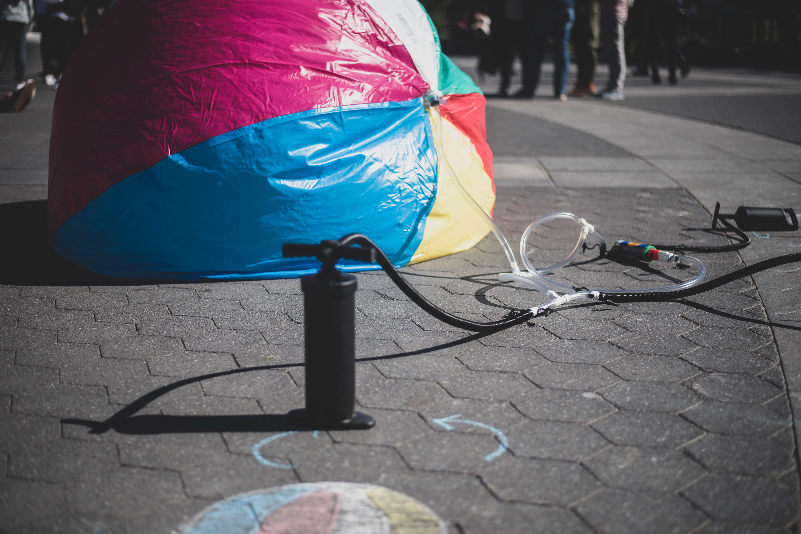

<iframe frameborder="0" allowfullscreen="" scrolling="no" allow="autoplay;fullscreen" src="https://onelineplayer.com/player.html?autoplay=false&amp;autopause=false&amp;muted=false&amp;loop=true&amp;url=https%3A%2F%2Fwww.dropbox.com%2Fs%2F7el0o1f9b819jr5%2FThe%2520Ball.mp4%3Fraw%3D1&amp;poster=&amp;time=false&amp;progressBar=true&amp;overlay=true&amp;muteButton=true&amp;fullscreenButton=false&amp;style=light&amp;quality=auto&amp;playButton=true" style="position: absolute; height: 100%; width: 100%; left: 0px; top: 0px;"></iframe>

It takes place at Washington Square Park in New York City where the park is unintentionally divided into specific areas based on its different roles/functions. On the day of the experiment, an inflatable ball started as a deflatable piece that expected to be inflated by four air pumps that are attached at the end of four air tubes. The designed air tubes merged into a single tube that ultimately transported the air into the ball. The setup was unguarded and the only suggestive instruction was the ball-shaped chalk-drawing next to the pumps that reflected the final outcome of the big ball. Through the course of a couple of hours, pedestrians, tourists, families with kids, students and other groups of people would stop and contribute their share of air. Such a communal action eventually transformed the deflatable piece into a 6-ft tall inflatable ball that enabled everyone at the park to interact with, play with, pass around and share the same joyful experience of playing.

 

 

